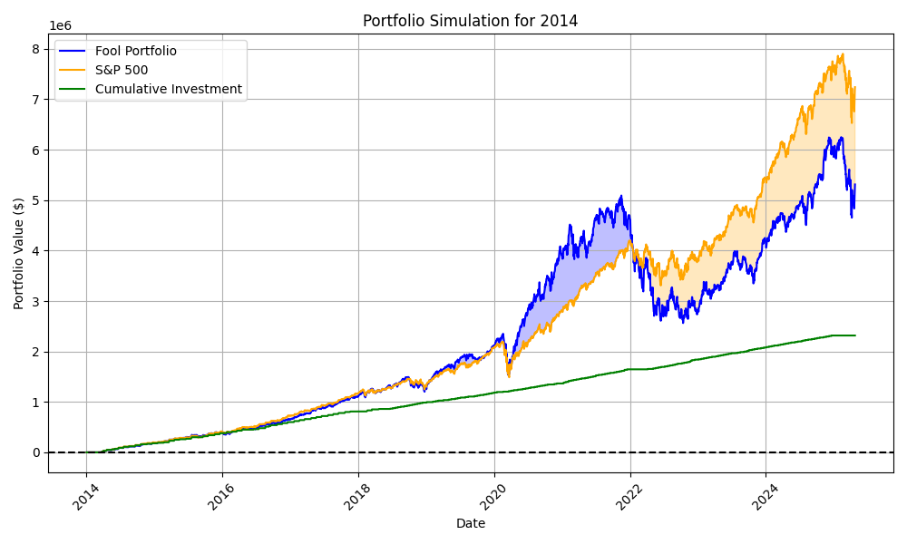

# Motley Fool Portfolio Simulator

This repository provides tools to analyze and simulate the performance of a stock portfolio based on Motley Fool's buy and sell recommendations.



## Features

- **PDF Parsing:** Extracts stock recommendations (buy/sell/hold) from a PDF file (`newrecs.pdf`) and saves them to a CSV file (`newrecs.csv`).
- **Symbol Validation:** Checks that extracted stock symbols and names are valid using Yahoo Finance.
- **Portfolio Simulation:** Simulates investing $10,000 in each recommended stock on a "buy" and selling all shares on a "sell", tracking the portfolio value over time.
- **Visualization:** Plots the simulated portfolio value to visualize performance.

## Usage

1. Place your Motley Fool recommendations PDF as `newrecs.pdf` in the project directory.
2. Run `parse_recommendations.py` to extract and validate recommendations:
    ```
    python parse_recommendations.py
    ```
3. Run `simulate_portfolio.py` to simulate and plot the portfolio:
    ```
    python simulate_portfolio.py
    ```

## Requirements

All dependencies are listed in `requirements.txt`.  
For development, a [Dev Container](.devcontainer/devcontainer.json) is provided for VS Code.

## Files

Source code

- `parse_recommendations.py` — Extracts and validates recommendations from PDF to CSV.
- `simulate_portfolio.py` — Simulates and plots the portfolio based on recommendations.
- `requirements.txt` — Python dependencies.
- `.devcontainer/` — VS Code development container configuration.
- `README.md` — This documentation.

Generated Files

- `newrecs.pdf` - Downloadeded from Motley Fool's Stock Advisor recommendations going back to 2014.
- `newrecs.csv` - The same recommendations converted to CSV
- `portfolio_simulation_YYYY.png` - portfolio simulations from a given start year

